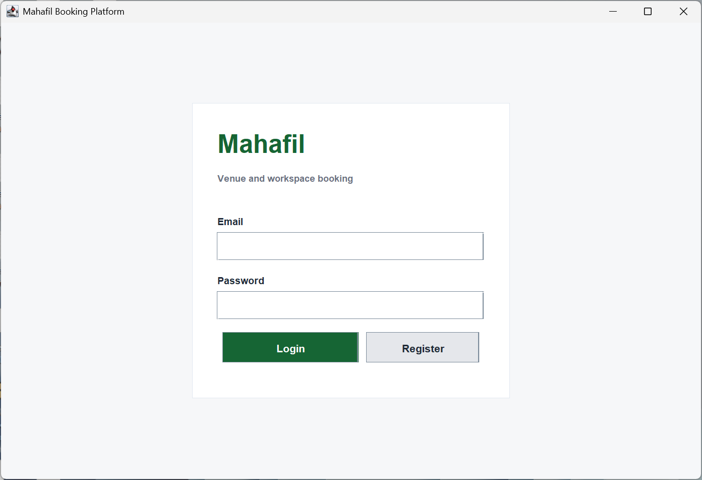
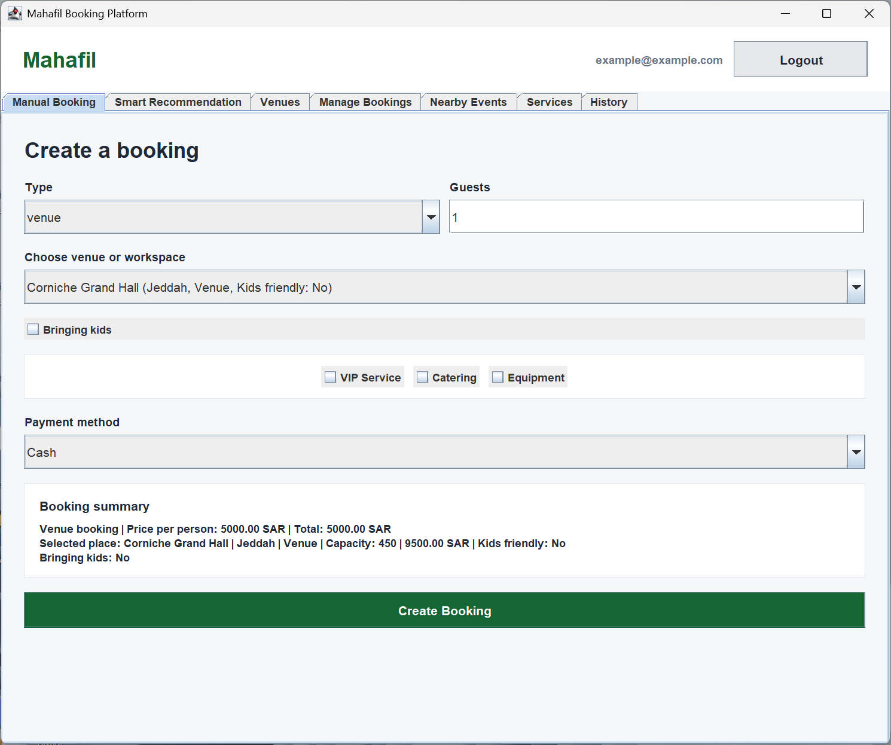
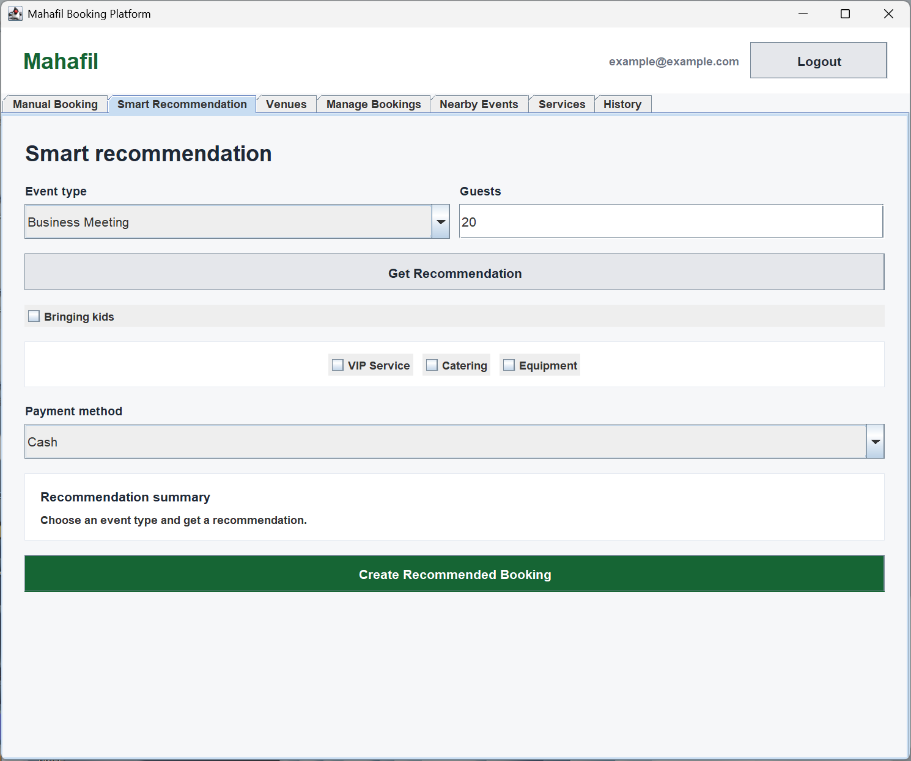
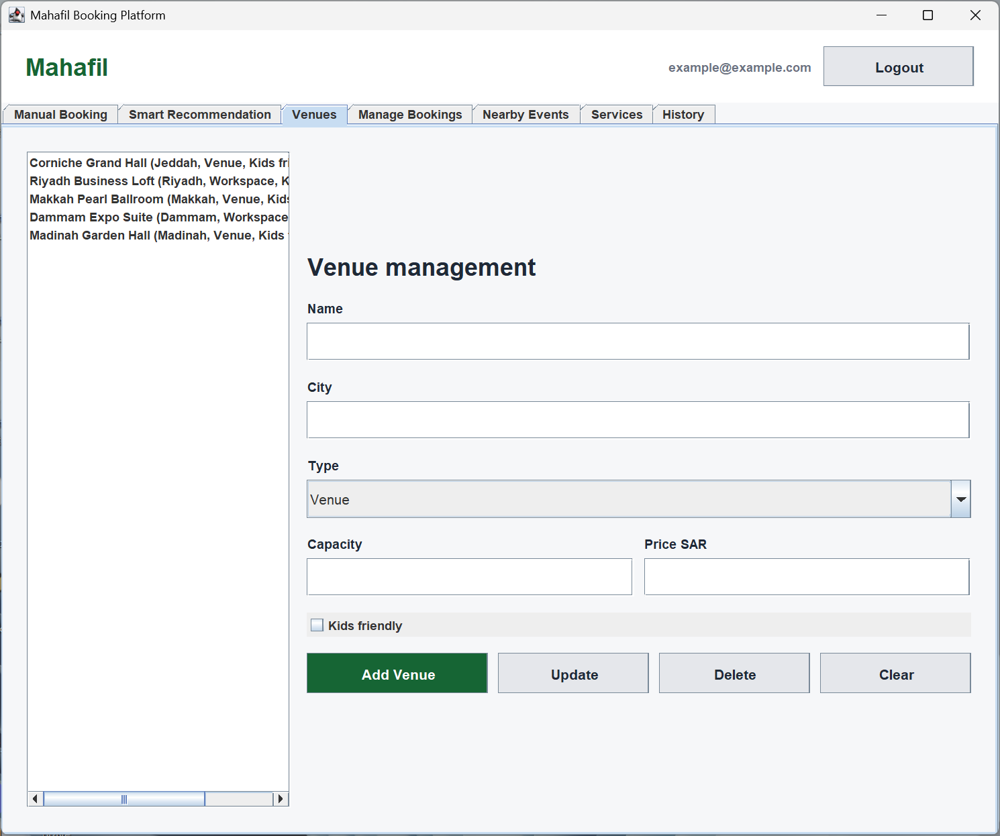
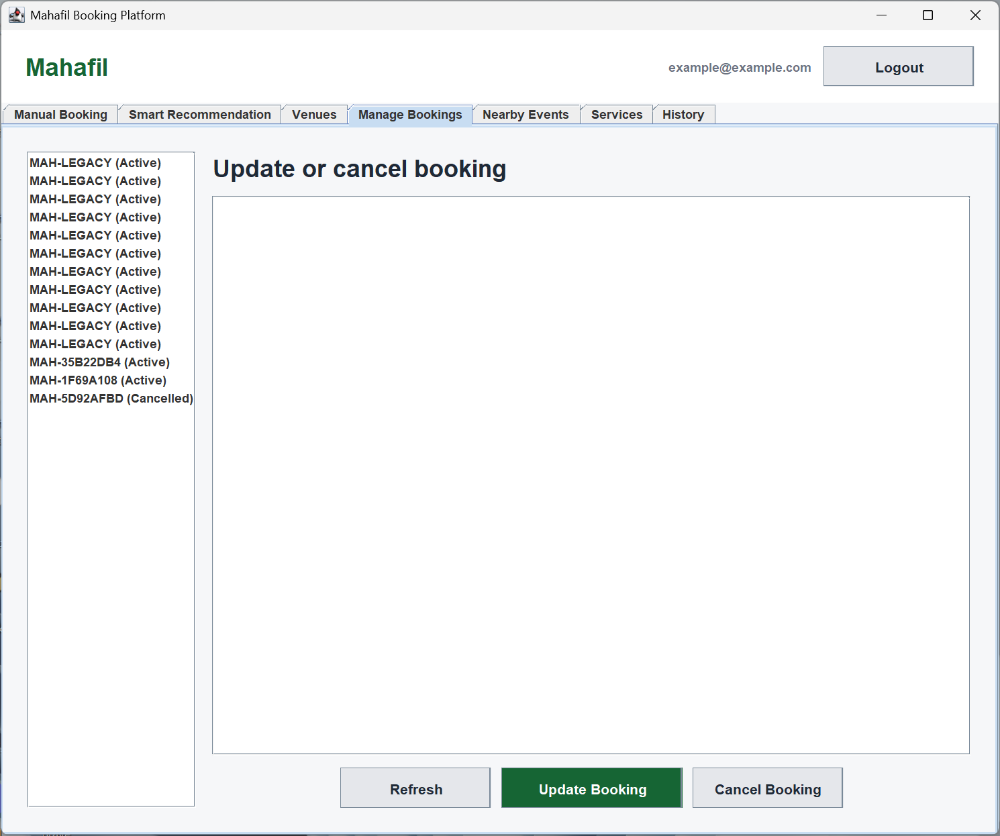
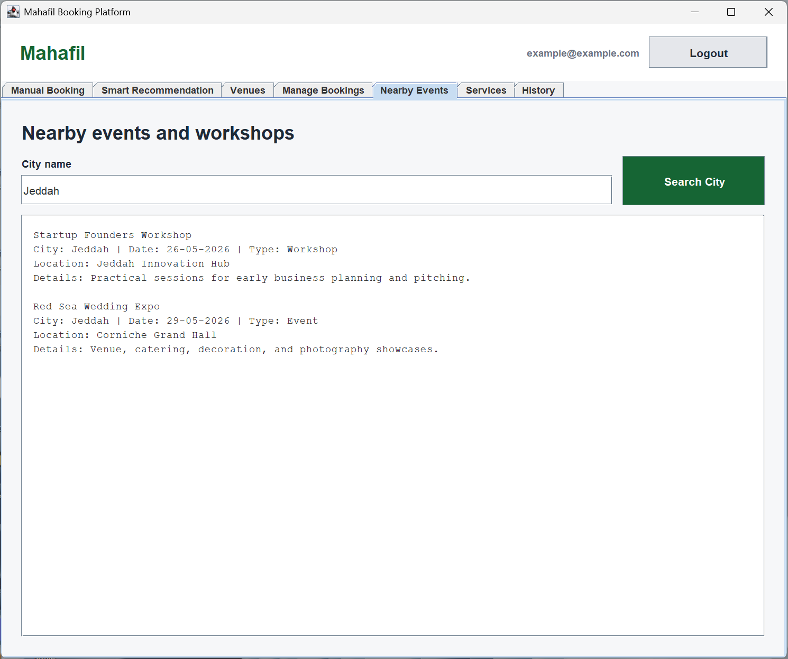
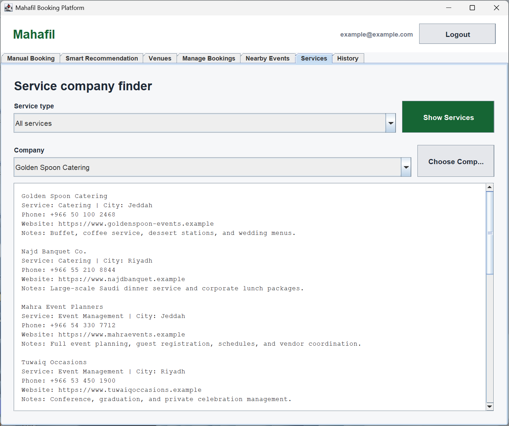
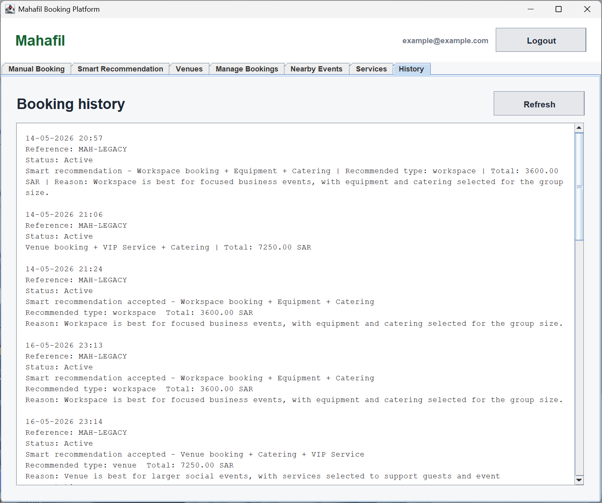

# Project Name
Mahafil – Venue and Workspace Booking Platform

## Description
Mahafil is a booking platform for wedding halls, offices, and coworking spaces in Saudi Arabia. It
provides a single system where users can search, compare, and book venues easily, while venue
owners can manage listings and reservations digitally.
Currently, most venue bookings in Saudi Arabia are handled through phone calls or social media,
with no unified platform. This results in unclear availability, inconsistent pricing, and inefficient
booking processes. Venue owners also depend on manual management, which increases the risk
of double bookings and lost customers


## Features
### Account
- Register an account
- Login with email and password

### Venue Management
- Add a new venue
- View list of venues
- Update venue details
- Delete a venue

### Booking Management
- View all bookings
- Cancel a booking
- Update a booking
- View booking history
- Validate a booking

### Design Patterns
- Factory Pattern (Creational)
- Decorator Pattern (Structural)
- Strategy Pattern (Behavioral)

### Core Features
- Smart Booking Recommendation 
- Nearby events and workshops
- Service's company finder
- Kids-friendly venue and booking option

## Application Modes (GUI & Console)

The application supports two modes of execution:

- **GUI Mode**: Runs with a graphical user interface for user-friendly interaction.
- **Console Mode**: Runs in terminal/command-line.

### Running with Docker

When running inside Docker, the application automatically uses **Console Mode**, since GUI is not supported in container environments.

To run using Docker:
```bash
 docker build -t mahafil .
 docker run -it mahafil
```
---

## Screenshots

### GUI Screens

#### Login Page


#### Manual Booking Page


#### Smart Recommendation


#### Venue Management


#### Booking Management


#### Nearby Events


#### Services Page


#### Booking History


---

## Generative AI Usage Disclosure

This project was developed in accordance with the course policy on the use of generative AI tools.

Generative AI tools (such as ChatGPT) were used only in acceptable ways, including:
- Refining ideas and understanding concepts
- Debugging and fixing issues in our own code
- Refactoring and improving code structure
- Assisting with unit tests based on our existing logic
- Proofreading and improving documentation

All outputs from AI tools were reviewed, validated, and modified by the team. The final submission reflects our own work and understanding.

### Team Members
- Mohamad Alghamdi
- Sultan Aljedani
- Nayef Alhunaiti
